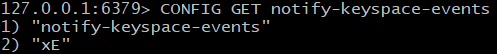
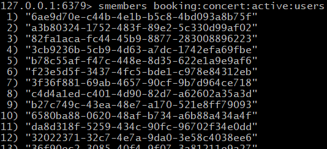
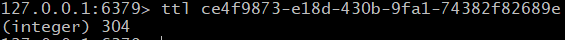
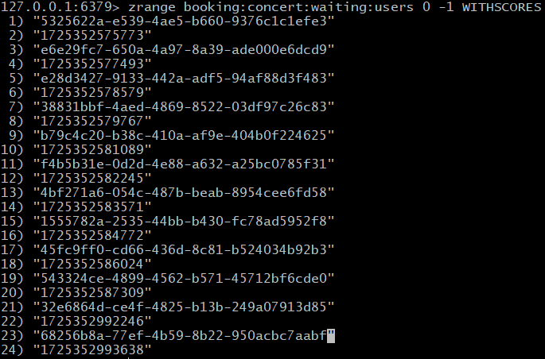

## 예약과 결제 트래픽 처리를 위한 Redis 대기열

### [대기열 정책]
- 최대 활성 수용 인원 : 50명
- 최대 작업 가능 시간 : 600초(10분)
- 활성 유저
  - 자료구조 타입 : Set 
  - 키 이름 : booking:concert:active:users
- 대기 유저
  - 자료구조 타입 : Sorted Set
  - 키 이름 : booking:concert:waiting:users
  - 스코어 : TimeMils

<br/>

***

### [대기열 흐름]
1. 대기열 토큰 생성
   - 활성 유저
     - 발급 시 최대 활성 수용 인원을 초과하지 않으면 활성 상태의 토큰을 발급 받는다.
     - 해당 활성 토큰은 Set에 등록이 되며 토큰을 이름으로한 TTL Key가 저장된다. 
   - 대기 유저
     - 발급 시 최대 활성 수용 인원이 초과되었을 경우 대기 상태의 토큰을 발급 받는다.
     - 해당 토큰은 TimeMils 값인 스코어로 매겨진 순번에 따라 대기하게 된다.

2. 토큰 만료 및 등록
   - 작업 및 TTL 만료
     1. 활성 토큰이 Set에서 제거됨과 동시에 그 토큰을 이름으로 갖는 TTL Key를 제거한다.
     2. 대기 Sorted Set에 대기자가 있을 경우 다음 작업을 수행한다.
   - 대기 토큰 활성화
     1. 활성 토큰 제거가 완료되면 Sorted Set의 1순위 대기자를 Set으로 등록시키며 그 토큰을 이름으로 갖는 TTL Key를 함께 생성한다.
     2. 해당 대기자의 토큰을 Sorted Set에서 제거한다.

<br/>

***

### [TTL 만료]
1. Redis Keyspace Notifications 설정 

    이벤트(예: 생성, 만료, 삭제)를 모니터링할 수 있는 기능인 Redis Keyspace Notifications 활성화

    
    
    
2. 애플리케이션에서 RedisMessageListenerContainer를 통해 레디스 메시지 수신
    ```java
    public class RedisKeyExpirationListener implements MessageListener {
        @Resource
        private RedisMessageListenerContainer redisMessageListenerContainer;
    
        private final RedisKeyEventService redisKeyEventService;
    
        public RedisKeyExpirationListener(RedisKeyEventService redisKeyEventService) {
            this.redisKeyEventService = redisKeyEventService;
        }
    
        @PostConstruct
        public void init() {
            redisMessageListenerContainer.addMessageListener(this, new ChannelTopic("__keyevent@0__:expired"));
        }
    
        @Override
        public void onMessage(Message message, byte[] pattern) {
            String expiredKey = message.toString();
            log.info("Expired key={}", expiredKey);
            redisKeyEventService.expire(expiredKey);
        }
    }
    ```
3. 활성토큰 만료 및 대기토큰 활성화
    ```java
   public class RedisKeyEventService {
    ...
        public void expire(String token) {
            removeTokenFromActive(token); // 활성 토큰 제거
            moveFirstWaiterToActive(); // 대기 토큰 활성화
        }
   }
    ```

<br/>

***

### [Redis-Cli]
1. 활성 토큰 목록
   
    
   
<br/>

2. 활성 토큰 이름의 TTL Key 

    

<br/>

3. 대기 토큰 목록 및 SCORE

    
    
    